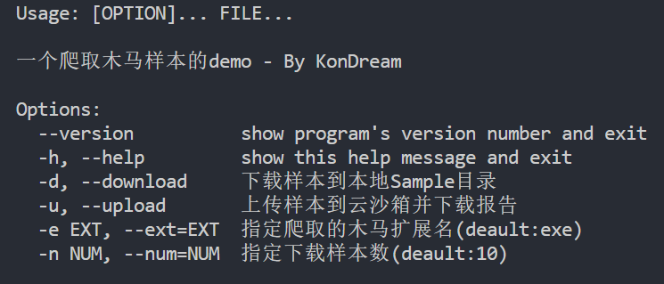
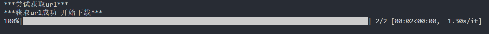
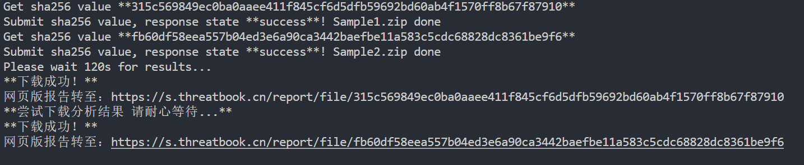

## 说明文档

## v1.1版本更新说明：

**解决了下载速度慢的bug，上传样本时可以指定区间**
 <hr/>
此工具主要提供两个功能：1、从 bazaar.abuse.ch 下载恶意样本 2、将恶意样本上传至微步云沙箱并下载流量包及报告

默认云沙箱环境：win7 office2013

仅做学习工具使用！！禁止进行任何非法用途！！

## Usage

```markdown
Options:
  --version          show program's version number and exit
  -h, --help         show this help message and exit
  -d, --download     下载样本到本地Sample目录
  -u, --upload       上传样本到云沙箱并下载报告
  -e EXT, --ext=EXT  指定爬取的木马扩展名(deault:exe)
  -n NUM, --num=NUM  指定下载样本数(deault:10)
  --start=START      上传起始序号(deault:1)
  --end=END          上传终止序号(deault:10)
```

### 下载样本

首次运行建议直接使用

```powershell
python GetSample.py -d 
```

默认下载10条样本

也可以使用 -n 指定样本下载数量(不超过1000)

```powershell
python GetSample.py -d -n 100
```

所有样本默认储存在 Sample 目录下

### 上传样本

使用 -u 选项直接将 Sample 目录下的全部样本上传至云沙箱

```powershell
python GetSample.py -u
```

下载的报告以 json 格式储存在 Report 目录下，流量包储存在 Pcap 目录下

## 待改进

目前我只限定了下载 exe 扩展名的木马样本，如有需要请手动修改代码第40行的 **white_list**，不保证别的扩展名不会出bug（笑

所有带密码的压缩包密码均是infected 我并没有做解压的操作而是直接上传压缩包


## 运行截图








